# **SuperStore Data Analysis**

## **Project Background**
SuperStore, established in 2019, is a fictional e-commerce company located in the United States that sells furniture, office supplies, and technology products. 

The company has significant amounts of data on customer orders that has been previously underutilized. This project will analyze and examine this data in order to uncover new insights and answer business questions that will enhance their business success and growth.

### **Insights and recommendations are provided based on the following key analysis areas and business questions:** 
- **Sales Trend Analysis**: How do sales and profit value evolve over time?
- **Regional Comparisons**: How do sales and profit vary across different states? 
- **Top Categories by Sales and Profit**: Which categories lead in terms of sales volume and profitability?
- **Top Sub-Categories by Sales and Profit**: What are the most successful sub-categories based on sales and profit?
- **Top Products by Sales and Profit**: Which products generate the highest sales and profit?
- **Return Rate by Category**: What are the return rates across different product categories?
- **Customer Segments with Highest Sales**: Which customer are driving the most sales?
- **Impact of Quantity Ordered on Profit**: How do order quantities influence profit?
- **Relationship Between Shipping Times and Returns**: Does longer shipping time lead to more product returns?

## **Data Structure & Initial Checks**
The source of data was obtained from Kaggle. Superstore’s data consists of 5901 rows from 2019 to 2020, containing one table of all sales transactions during that period.

The database structure can be seen below:   
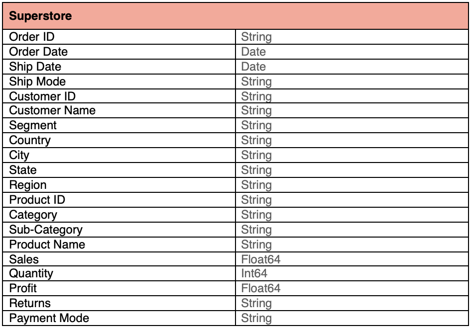

Prior to the analysis, quality checks were conducted to the dataset to ensure no null values or duplicate entries to improve the accuracy. The python code used to inspect and perform the quality checks can be found [here](./data-cleaning.ipynb). 

## **Executive Summary**
### **Overview of Findings**
Although sales overall have been increasing, the company’s profits continue to fluctuate, with some months dropping drastically in 2020. The company wants to continue to grow their sales, as well as their profits. The following sections will explore more contributing factors to the company’s situation and highlight key opportunities for improvement based on the business questions.

SQL queries were used to answer the business questions and are included throughout the report. The full SQL file can be found [here](./queries.sql).

The Tableau dashboard is shown below. The whole interactive dashboard can be found [here](https://public.tableau.com/app/profile/kristy.ho3727/viz/Book1_17269612867540/Dashboard1).
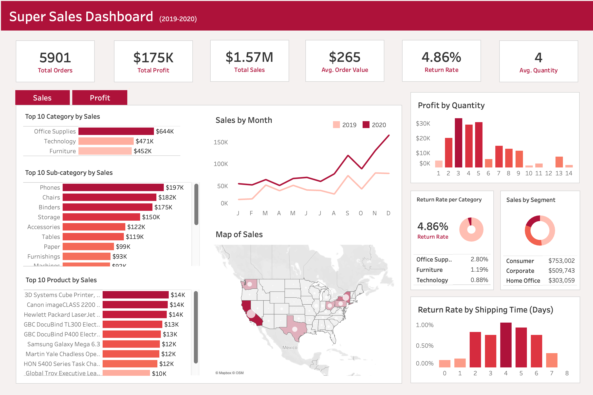    
&nbsp;

### **KPI’s:**
**SQL:**
~~~~
SELECT
	COUNT(*) AS `Total Orders`, 
	SUM(Sales) AS `Total Sales`, 
    SUM(Profit) AS `Total Profit`,
    AVG(Sales) AS `Avg Order Value`,
    ROUND(AVG(Quantity)) AS `Avg Product Quantity`,
    ROUND(AVG(DATEDIFF(`Ship Date`, `Order Date`))) AS `Avg Delivery Time`,
	(
	    SELECT COUNT(`Returns`) 
        FROM superstore
	    WHERE `Returns` = "Yes"
    ) 
    / COUNT(*) * 100 AS `Avg Return Rate (%)`
FROM superstore;
~~~~
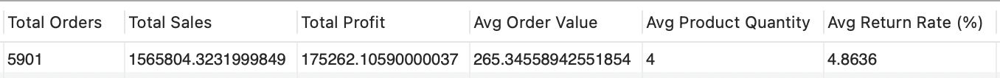  

\
**Insights:**
- Over a two-year period, Superstore had **5901 orders**, generating a **total revenue of $1.57 million** with a **gross profit of only $175K**. This indicates a **gross profit margin of 11.15%**, indicating relatively high operation costs. 
-	The company’s **average order value (AOV) was $265**, and customers purchased an **average of 4 items per order**. The **return rate was 4.86%**.  
&nbsp;

### **Sales Trend Analysis: How do sales and profit value evolve over time?**
**SQL:**
~~~~
SELECT 
	YEAR(`Order Date`) AS `Year`,
	MONTH(`Order Date`) AS `Month`, 
    SUM(Sales) AS `Total Sales`, 
    SUM(Profit) AS `Total Profit`,
    ROUND((SUM(Profit)/SUM(Sales))*100, 2) AS `Profit Margin (%)`
FROM superstore
GROUP BY `Year`, `Month`;
~~~~
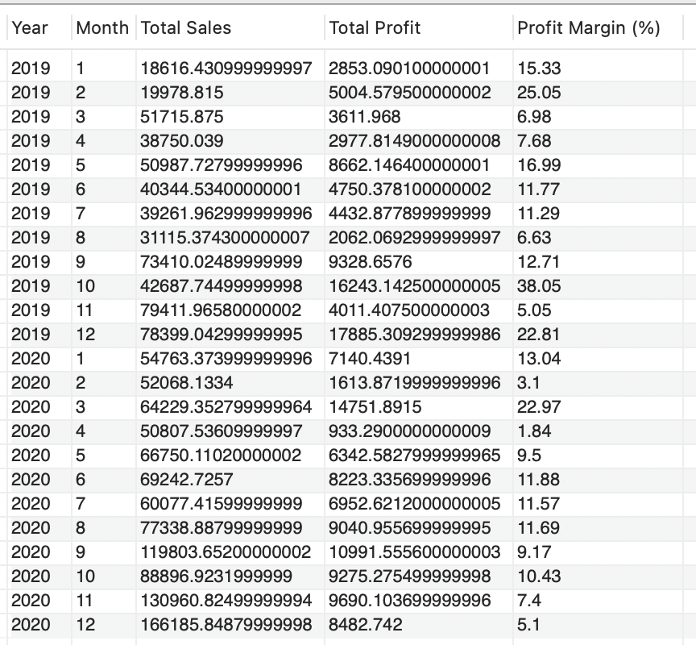    

\
**Insights:**
-	There was a **positive revenue year-over-year growth from 2019 to 2020**, with the company experiencing sustained growth throughout most months. The growth remained steady across the year, except for notable **peaks in September, November, and December** due to the back-to-school and holiday seasons.
-	For the year 2019, the company’s sales **peaked in December** with a **revenue of $78,399**, while for the year 2020, sales again **peaked in December** with a **revenue of $166,186**, marking a **112% increase in December sales year-over-year**. These peaks align with holiday seasonality patterns.
-	In 2019, the company saw some high profit margins in **February (25.05%)** and **October (38.05%)**, with October having the highest profit margin.
-	In 2020, while revenue increased, profit margins fluctuated more significantly. For instance, **March 2020 had a strong profit margin of 22.97%**, while **April 2020 had a much lower margin of 1.84%**, indicating possible increased costs or operational challenges.  
&nbsp;

### **Regional Comparisons: How do sales and profit vary across different regions and states?**
**SQL:**
~~~~
SELECT 
	Region,
    SUM(Sales) AS `Total Sales`, 
    SUM(Profit) AS `Total Profit`
FROM superstore
GROUP BY Region
ORDER BY `Total Sales` DESC;
~~~~
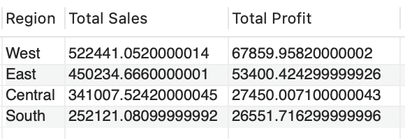  

&nbsp;

~~~~
SELECT 
	Region,
	State, 
    SUM(Sales) AS `Total Sales`, 
    SUM(Profit) AS `Total Profit`
FROM superstore
GROUP BY Region, State
ORDER BY `Total Sales` DESC;
~~~~
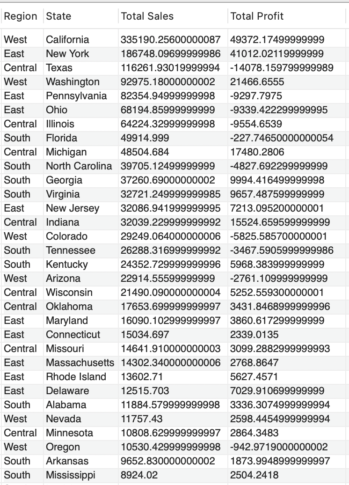    

\
**Insights:**
-	The **West** region stood out with the highest **revenue of $522K and a profit of $68K**. Within the West, **California and Washington** were the top contributors to both the company’s revenue and profit.
-	The **East** followed with a **revenue of $450K** and a **profit of $53K**. Within the East, **New York** was the top contributor in terms of revenue and profit in the region. 
-	The **Central** had a **revenue of $341K and a profit of $27.4K** and the **South** has a **revenue of $252K and a profit of $26.6K**, indicating that these regions may have unexplored potential. 
-	**Negative profit figures** are seen in several states, including **Pennsylvania** and **Ohio** in the East, **Florida** and **North Carolina** in the South, and **Texas** in the **Central**, indicating potential issues in those areas.  
&nbsp;

### **Best-Selling and Most Profitable Categories: Which categories lead in terms of sales volume and profitability?**
**SQL:**
~~~~
SELECT 
    Category, 
    SUM(Sales) AS `Total Sales`
FROM superstore
GROUP BY Category
ORDER BY SUM(Sales) DESC;
~~~~
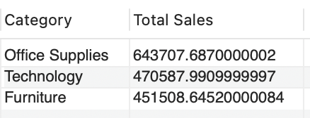  

&nbsp;

~~~~
SELECT 
    Category, 
    SUM(Profit) AS `Total Profit`
FROM superstore
GROUP BY Category
ORDER BY SUM(Profit) DESC;
~~~~
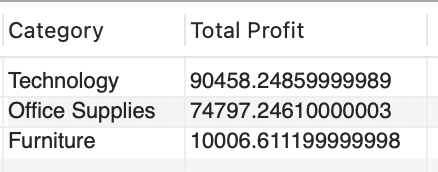

\
**Insights:**
-	The **best-selling category** over the two-year period is **Office Supplies**, generating a **total revenue of $644K**. However, despite its high sales volume, it does not lead in profitability with a **profit of $75K** over that period.
-	The **most profitable category is Technology**, with a **profit of $90K** over the same period. Although Technology ranks second in sales, with **total revenue of $471K**, it outperforms other categories in terms of profit, indicating higher profit margins in this category.  
&nbsp;

### **Top Sub-Categories by Sales and Profit: What are the most successful sub-categories based on sales and profit?**
**SQL:**
~~~~
SELECT 
    `Sub-Category`, 
    SUM(Sales) AS `Total Sales`
FROM superstore
GROUP BY `Sub-Category`
ORDER BY SUM(Sales) DESC
LIMIT 10;
~~~~
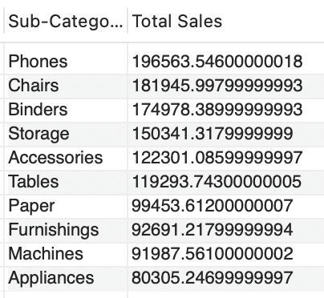  

&nbsp;  

~~~~
SELECT 
    `Sub-Category`, 
    SUM(Profit) AS `Total Profit`
FROM superstore
GROUP BY `Sub-Category`
ORDER BY SUM(Profit) DESC
LIMIT 10;
~~~~
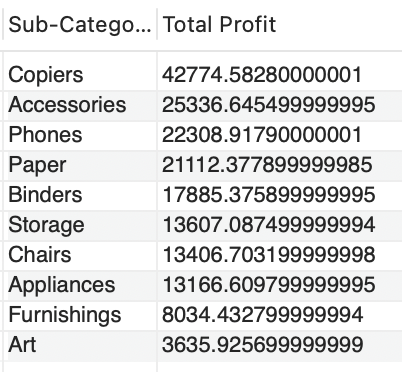 

\
**Insights:**
-	The **best-selling sub-categories** over the two-year period are **Phones, Chairs, and Binders**, which together generated **$554K in revenue**, accounting for **35% of the company’s total revenue.**
-	The **most profitable sub-categories** are **Copiers, Accessories, and Phones**, indicating that while **Phones** are both high in sales and profitability, **Copiers and Accessories** yield greater profits despite lower sales volumes.
-	Conversely, **Tables and Supplies** are facing significant financial challenges, having **negative profits**, indicating that costs are outweighing sales revenue.  
&nbsp;

### **Top Products by Sales and Profit: Which products generate the highest sales and profit?**
**SQL:**
~~~~
SELECT 
    `Product Name`, 
    SUM(Sales) AS "Total Sales"
FROM superstore
GROUP BY `Product Name`
ORDER BY SUM(SALES) DESC
LIMIT 10;
~~~~
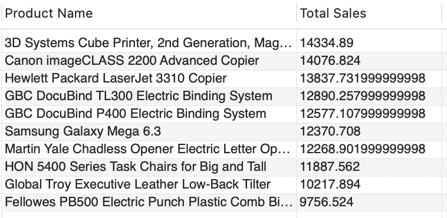    

&nbsp;

~~~~
SELECT 
    `Product Name`, 
    SUM(Profit) AS "Total Profit"
FROM superstore
GROUP BY `Product Name`
ORDER BY SUM(Profit) DESC
LIMIT 10;
~~~~
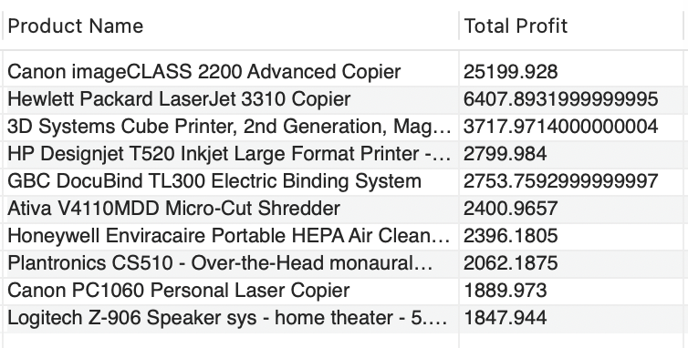  

\
**Insights:**
-	The **best-selling products** over the two-year period are the **3D Systems Cube Printer (2nd Generation, Magenta), Canon imageCLASS 2200 Advanced Copier, and Hewlett Packard LaserJet 3310 Copier.**
-	The **most profitable products** are the **Canon imageCLASS 2200 Advanced Copier, Hewlett Packard LaserJet 3310 Copier, and 3D Systems Cube Printer (2nd Generation, Magenta).**
-	Notably, the **Canon imageCLASS 2200 Advanced Copier** leads significantly in profit, with a **total profit of $25,199.93**, which represents **14% of the company’s total profit.**  
&nbsp;
### **Return Rate by Category: What are the return rates across different product categories?**
**SQL:**
~~~~
WITH Return_count AS (
	SELECT 
		`Returns`, 
		Category, 
        COUNT(`Returns`) AS `Return Total`
	FROM superstore
    WHERE `Returns` = "Yes"
	GROUP BY 
		`Returns`, 
        Category
)
SELECT 
    Category,
    `Return Total`/(SELECT COUNT(*) FROM superstore) * 100 AS `Return Rate (%)`
FROM Return_count
ORDER BY `Return Rate (%)` DESC;
~~~~
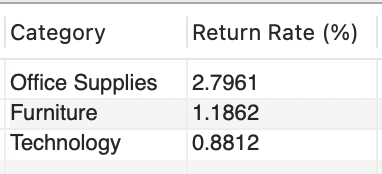

\
**Insights:**
-	**Office Supplies** exhibits the highest **return rate at 2.80%**, indicating potential issues with customer satisfaction or product quality in this category.
-	**Furniture** follows with a **return rate of 1.19%**, indicating that while it performs better than Office Supplies, there may still be factors influencing customer returns, such as fit or durability concerns.
-	**Technology** has the lowest **return rate at 0.88%**, reflecting strong customer satisfaction and possibly higher quality standards in this category.  
&nbsp;

### **Customer Segments with Highest Sales: Which customer are driving the most sales?**
**SQL:**
~~~~
SELECT 
    Segment, 
    SUM(Sales) AS `Total Sales`
FROM superstore
GROUP BY Segment
ORDER BY SUM(Sales) DESC;
~~~~
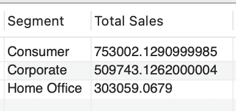    

\
**Insights:**
-	The **Consumer** segment leads with approximately **$753,002 in sales**, indicating strong individual demand.
&nbsp;

### **Impact of Quantity Ordered on Profit: How do order quantities influence profit?**
**SQL:**
~~~~
SELECT 
	Quantity, 
    SUM(Profit) AS `Total Profit`
FROM superstore
GROUP BY Quantity
ORDER BY SUM(Profit) DESC;
~~~~
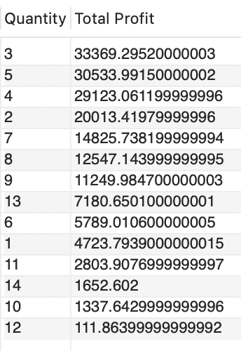    

\
**Insights:**
-	The order quantities of **3, 4, and 5** units are the leads in driving profit. These quantities likely optimize the balance between production costs and sales revenue, indicating that customers are more likely to purchase in these quantities.  
&nbsp;

### **Relationship Between Shipping Times and Returns: Does longer shipping time lead to more product returns?**
**SQL:**
~~~~
WITH Return_count AS (
    SELECT 
        DATEDIFF(`Ship Date`, `Order Date`) AS `Shipping Time (days)`, 
        COUNT(*) AS `Return Count`
    FROM superstore
    WHERE `Returns` = "Yes"
    GROUP BY `Shipping Time (days)`
)
SELECT 
    `Shipping Time (days)`, 
    `Return Count` / (SELECT COUNT(*) FROM superstore) * 100 AS `Return Rate (%)`
FROM Return_count
ORDER BY `Shipping Time (days)`;
~~~~
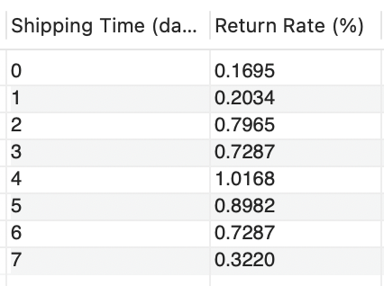    

\
**Insights:**
-	As shipping time increases, the return rate also generally increases, starting from **0.1695% at 0 days** and **peaking at 1.0168% for 4 days of shipping.**
-	The return rate climbs significantly between **1 day (0.2034%)** and **2 days (0.7965%)**, indicating that customers may be more likely to return products when shipping takes longer than expected.  

## **Recommendations**
- Due to the high peaks in sales and profit during **back-to-school and holiday seasons**, work with the marketing team to **target campaigns and promotions** during these times.
-	As the technology category yields the highest profit, **provide promotional incentives for these products to further boost sales.** 
-	**Target the underperforming states.** Provide localized marketing campaigns to address the negative profits in states like Texas, Pennsylvania, and Florida.
-	**Re-evaluate the Table and Supplies sub-categories.** As these sub-categories have negative profits, consider phasing out the products and offering bundles to sell the current remaining products. 
-	With a high return rate of 2.78% for the Office Supplies category, **implement customer feedback surveys to improve product quality and customer satisfaction.**
-	**Target the consumer segment.** As the consumer segment leads the sales, work with the marketing team to tailor towards this demographic to enhance customer loyalty and repeat purchases.
-	Given that order quantities of 3, 4, and 5 units are the most profitable, **implement bundle offers to encourage larger order quantities that will maximize profit.   
-	Due to the positive correlation between longer shipping times and higher return rates, **build partnerships with reliable shipping providers to ensure fast shipping times.**

